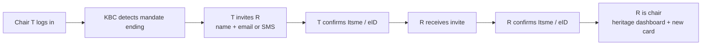
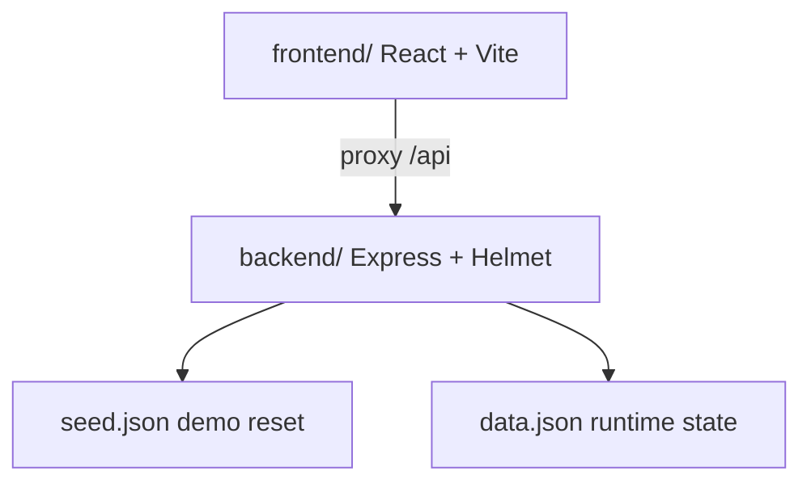

# Mandate Continuity for Association Accounts

A KBC proof of concept for **secure handover of association accounts**.

When a mandate ends — a scout troop, a sports club, an ASBL — the outgoing chair does not pick from a bank “member list”. They **invite a successor by name**, via **email or mobile**, then both parties prove their identity with Itsme / eID. The incoming chair inherits the **account, the payment card, and the financial memory**.

---

## How it works



Two-party check: ownership does not move until **both** identities are verified.

## Repo structure



| Path | Role |
| --- | --- |
| `frontend/src/App.jsx` | Screens: invite, Itsme, heritage dashboard |
| `backend/server.js` | Mandate check, invite, accept, reset |
| `backend/seed.json` | Alice alone on Scout Troop 123 |
| `backend/data.json` | Live state (gitignored after Aikido setup) |

---

## Problem

Association accounts change hands every year. Today that change is late, manual, and incomplete:

- The bank does not anticipate the end of a mandate.
- There are no other authorised members sitting on the account; the next chair must be **invited**.
- Identity of the incoming person is weakly guaranteed.
- The new chair starts without history: no P&L, no succession of previous chairs, no operational context.

## Solution

KBC detects that a mandate is ending and prompts the current chair to start a handover. The chair enters **first name, last name**, and an **email or mobile number**. After a two-party Itsme / eID check, ownership switches. The incoming chair lands on a **heritage dashboard**: balance, cash-flow, timeline of previous chairs, and a **downloaded PDF statement**. A new card is issued in their name.

Prototype account: **Scout Troop 123**, current chair **Alice Dupont**. Nobody else is on the account until she sends an invitation.

---

## Product walkthrough

1. Sign in as Alice. If the mandate cycle is ending, a banner invites her to prepare the handover.
2. She fills in the successor (name + email or mobile) and confirms with simulated Itsme / eID. An invitation is sent on that channel.
3. Sign in as the invited person (they appear in the selector after the invite). They confirm with Itsme / eID.
4. Ownership moves. The new chair sees the heritage dashboard and can download the statement PDF.

Use **Reset demo** in the header to return to Alice alone on the account.

---

## Security model

Handover is a **two-party check**. The API rejects the operation unless:

- the current chair initiates the transfer;
- a successor is invited with name + email or mobile (not self);
- the invited successor is the one who accepts;
- each step carries a verified identity token;
- acceptance happens only while a transfer is pending.

`chiefId` does not change until both validations succeed. After completion, the timeline is updated and card issuance is triggered (`in_transit`).

**Helmet** sets security headers on the API (Aikido finding: Express was not emitting them).

Itsme / eID is simulated in the UI. Mandate detection uses a seasonal rule (September).

---

## Getting started

Requires Node.js.

```bash
# from the repo root (npm workspaces)
npm install

# API — http://localhost:3001
cd backend && npm start

# UI — http://localhost:5173
cd frontend && npm run dev
```

Open the UI only. Vite proxies `/api` to the backend.

To show the succession banner outside September:

```bash
cd backend && FORCE_MANDATE=1 npm start
```

### Integrating a teammate’s push

Your local work is uncommitted; theirs is on `origin/main`. Do **not** commit `node_modules`.

```bash
git stash push -m "wip" -- README.md backend frontend/src frontend/index.html
git pull --ff-only origin main
git stash pop
# if a file conflicts, keep both: Helmet + our invite logic
npm install
```

If `git pull` complains about `frontend/node_modules`, restore those files first (`git restore -- frontend/node_modules`) then pull again. After `.gitignore` includes `node_modules/`, stop adding that folder.

---

## API

| Method | Path | Description |
| --- | --- | --- |
| `GET` | `/api/account` | Account, current chair, timeline, transactions |
| `GET` | `/api/check-mandate` | Mandate status and handover suggestion |
| `POST` | `/api/handover/initiate` | Invite by name + email or SMS + outgoing Itsme |
| `POST` | `/api/handover/accept` | Incoming Itsme; switches chair |
| `POST` | `/api/reset` | Restore seed data |

**Stack:** React, Vite, Tailwind CSS, Recharts, jsPDF · Node.js, Express, Helmet · JSON store.

**Brand (kbc.be):** navy `#0a2f6b` / `#1b1464`, teal `#00a39a`, cyan `#00b5e2`.

---

## Production path

Live Itsme / eID replaces the simulated token; association detection replaces the month rule; a real mailbox or SMS gateway sends the invite; card issuing sits behind the same handover events.
